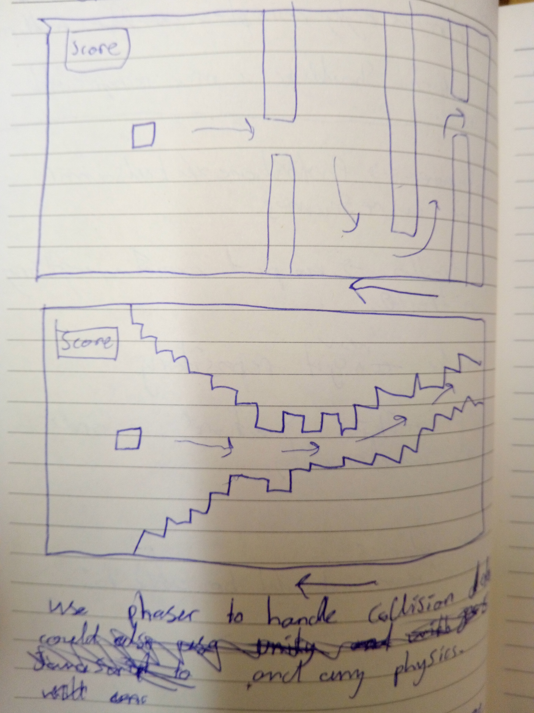

# Sparta-Core-Project-1
My first project for Sparta

***

#README 

***

##Table of contents 

* [Instructions](#instructions) 

* [Requirements](#requirements)
* [Task](#task)
* [Wireframes](#wireframes)
* [Challenges](#challenges)
* [What I'm pleased with most](#pleased)
* [How to play the game](#how)
* [Screenshots of the game](#ss)
* [Future additions](#future)
* [Mobile demo video](#demovid)
* [Livelink](#ll)

***

## Instructions

There are two ways to run the game:
 
1. Click on the [Livelink] (https://kaneofthrones.github.io/Sparta-Core-Project-1/)
2. Download the files and run index.html

***

## Requirements

The game requires an internet connection as CDN's are used for the display and JQuery.

However you can download both Bootstrap and JQuery to link them locally

The game uses the following:

* Bootstrap 4.0 (beta)
* JQuery
* Google Fonts

***

## Task

The task was to build a game using HTML CSS and Javascript to demonstrate everything I have learned in the first two weeks of my training

I tackled this task in the following order:

1. Planning
	* write down three ideas for games I would want to make
	* Make Wireframes for the said games
	* Get approval from my trainer for one of the games
	* Make a Trello board consisting of user stories, acceptence criteria and sprint objectives

###Wireframes

The game I ended up choosing was the backup game (above) 

The last two wireframes were for my initial game suggestion. A flappy bird clone made using a html5 framework known as Phaser. I took the advice of my trainer and decided not to do this mainly for these two reasons:

1. I have never used the Phaser framework before and I had to have an MVP operational after sprint one (three days).
2. This project was about showcasing my knowledge of everything I have learned so far(HTML, CSS & JS), not my knowledge of a game making framework

###Trello board

I tried to give my user stories a more personal touch to get into the mindset of the user and then ranked them using the Fibonacci sequence in order of difficulty, starting at 1(very easy) and finishing at 13(very difficult)

This is how I planned for the task that was given, the next phase was to start writing Pseudo code

***

##Challenges

I faced several challenges with this project, these challenges were:

* Knowing where, when and how to start coding. It was daunting how much I had to do and where I am now seemed so far away in the beginning
* Getting my logic working
	* The game needs a random sequence on a set of keys to be displayed to the user and then the user needs to enter the correct sequence, so the game needs to check the user input against the sequnce that was displayed
* Animations 
	* I only have one animation because they were not covered and I only had time to do one tutorial on animations and applied the little that I learned in the time given (one week)
* Audio 
	* I had no experience using audio with HTML or JS so I had to figure out how to use the HTML audio and play it with javascript
* Making a fully responsive game/site
	* I wanted the game to look good on mobiles so I decided to make the game with a mobile first approach which was hard at first

***

##What I'm pleased with most

What I am most pleased with is how I overcame the challenges listed above. It seemed very hard in the beginning and now I cannot understand what the fuss was about

I am also very pleased with the number of commits done as that was an issue in the past and I get huge satisfaction from seeing all my commits lined up at the end of the day when I submit a pull request

I asked for help at times when I needed it. I try to be able to stand alone but I am pleased I got help when I was really stuck

***

##How to play the game

The game is played as follows:

* The game will present you with five keys
* The keys will flash purple in a random sequence, 1 then 2 then 3 and so on
* You have to click the keys in the order they are shown
* The order will start from the beginning each time you enter the correct sequence
* If you dont click in the same order as shown, it is the next player's turn, every two rounds, the high scores are compared and a winner is declared

The game also has another mode for large devices only

* The 'a' 's' 'd' 'f' and 'g' keys are a drum kit and the 'm' key is used to play music, the 'p' key will pause the music and the 'r' key will resume the music. The music requires alot of percussion so the music can be played in the background as you practise your digital drumming skills

### Screenshots

Here are some screenshots of the game: 

Instruction screen

Game over screen

Mobile view

## Future Additions

There are several things I could add to this game in the future, some of these are: 

* A volume bar for PC users to control audio levels
* Add animations and further decoration to the game
* shadow effect for the keys
* Add more keys
* Make code more DRY
* Add more sounds
* Add a screen allowing users to pick between 1 and 2 player modes
* keep highscores in local storage
* allow users to enter their names on their highscores
* allow users to upload their own background music

***

## Demo Video

[Demo Video](https://youtu.be/uHQOhZxQpss)

***

##[Livelink] (https://youtu.be/2ISwLyPpLls)
